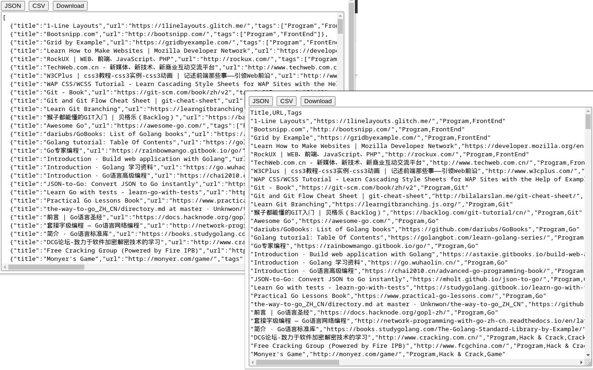
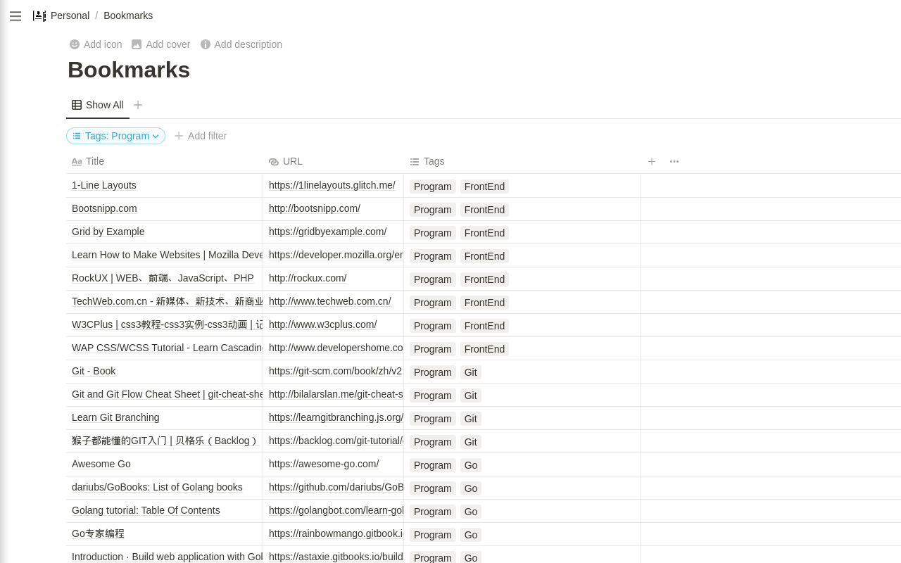

# BookmarksExporter

## Summary
Export bookmarks as flat JSON/CSV, folders as tags.

## Description

Browser can export bookmarks as HTML file and there are extensions that can export bookmarks as JSON file, but their export files keep folder structure/hierarchy.

Sometimes, the flat file structure (without folder hierarchy) is easier to read and import into other program. For instance, flat JSON and CSV files can be easily imported into database or tools like Notion, Excel.

To keep folder structure info, this extension exports folder(s) as tags, it's easy to tell what folder(s) a particular bookmark item was in by looking at tags.

## Screenshots

Extension screenshot(s)
#  

Imported into Notion
#  